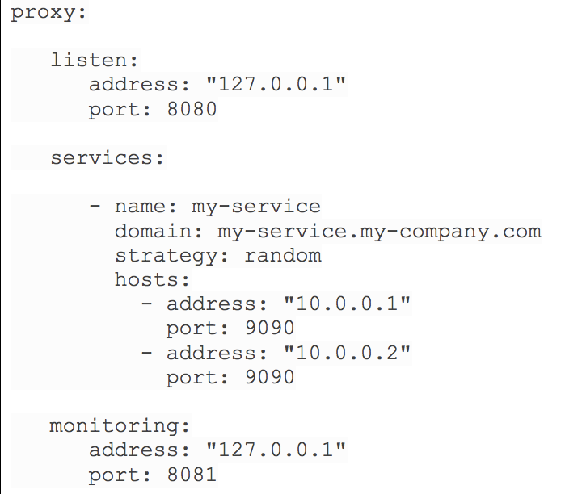
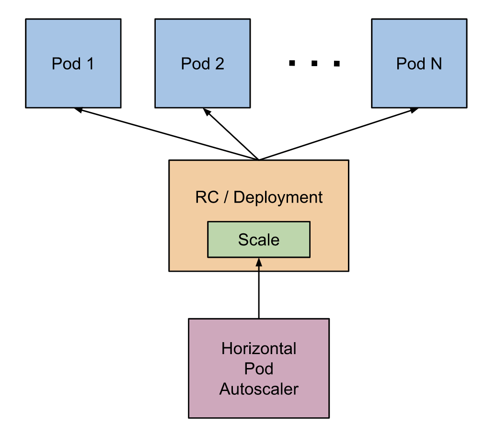
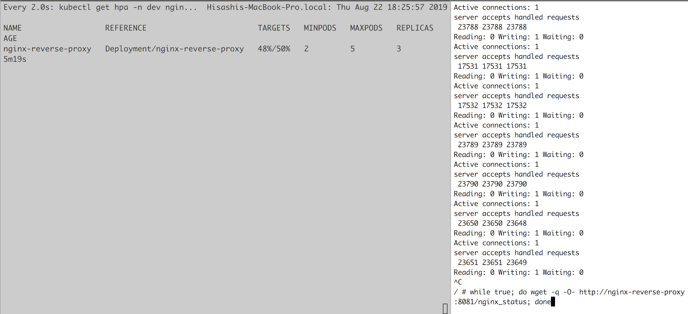

# Get Started with Custom Nginx with Docker, Helm, and Kubernetes
Index
- [Requirements](#requirements)
- [Prerequisites](#prerequisites)
- [Project Structure](#project_structure)
- [Custom Nginx Config](#nginx_config)
- [Install the custom Nginx to Kubernetes using the custom Helm Chart](#nginx_helm_chart)
- [Define and Implement SLI for Nginx](#k8s_nginx_sli)
  - [Update/Rollback](#k8s_nginx_sli_update_rollback)
  - [Autoscaling](#k8s_nginx_sli_autoscalling)
  - [How to Test](#k8s_nginx_sli_test)
- [Cleanup](#cleanup)
- [(Advanced) Get Further (Use Kubernetes Nginz Ingress Controller)](#get_further)

## Requirements <a name="requirements"></a>
For this demo, we are going to achieve the following requirements:


- Reverse Proxy/Load balancer 127.0.0.1:8080
- Downstream services at 10.0.0.[1-2]:9090
- Monitoring at 127.0.0.1:8081
- Deploy the reverse proxy using Helm Chart to Kubernetes cluster
- Implement some SLI 

## Prerequisites <a name="prerequisites"></a>
- docker
- kubectl
- helm

## Project Structure <a name="project_structure"></a>
```
$ tree
.
├── README.md
├── docker
|   ├── README.md
│   ├── nginx.conf
├── helm
│   ├── README.md
│   ├── reverse-proxy
│   └── reverse-proxy-0.1.0.tgz
├── k8s
│   ├── README.md
│   ├── dashboard
│   ├── echo-server
│   └── ingress-resources
```
- `/docker` contains a dockerlized custom Nginx 
- `/helm` contains a custom Helm chart `reverse-proxy` which uses the custom Nginx docker image created in `/docker` folder
- `/k8s` contains extra steps to build a reverse proxy using Kubernetes's built-in Nginx Ingress Controller

## Custom Nginx Config <a name="nginx_config"></a>
The config is located at [docker/nginx.conf](docker/nginx.conf).

In short, the Nginx docker listens to port 8080 and 8081.
```
# 8080 for reverse proxy
my-service.my-company.com:8080 -> nginx -> 10.0.0.1:9090
                                        -> 10.0.0.2:9090

# 8081 for monitoring
127.0.0.1:8081 -> nginx -> 127.0.0.1:8081/nginx_status
```

Dockerized and its image is available at `hasakura12/nginx-reverse-proxy:1.00`.

For more details, refer to [/docker/README.md](/docker/README.md).

## Install the Custom Nginx to Kubernetes using the Custom Helm Chart <a name="nginx_helm_chart"></a>
Start a K8s cluster on minikube
```
$ minikube start \
  --extra-config=kubelet.authentication-token-webhook=true
```
Deploy Helm Tiller
```
$ helm init
```
Wait for a few minutes until tiller-deploy becomes available
```
$ kubectl get deploy tiller-deploy -n kube-system
NAME            READY   UP-TO-DATE   AVAILABLE   AGE
tiller-deploy   1/1     1            1           73m
```
Install the custom Helm Chart for the custom Nginx docker image
```
$ helm install -n nginx-reverse-proxy --namespace dev helm/reverse-proxy/
```
should return 
```
NAME:   nginx-reverse-proxy
LAST DEPLOYED: Wed Aug 21 19:53:32 2019
NAMESPACE: dev
STATUS: DEPLOYED

RESOURCES:
==> v1/Deployment
NAME                 READY  UP-TO-DATE  AVAILABLE  AGE
nginx-reverse-proxy  0/1    1           0          0s

==> v1/Pod(related)
NAME                                  READY  STATUS             RESTARTS  AGE
nginx-reverse-proxy-774d6c4d49-77n4g  0/1    ContainerCreating  0         0s

==> v1/Service
NAME                 TYPE      CLUSTER-IP    EXTERNAL-IP  PORT(S)                        AGE
nginx-reverse-proxy  NodePort  10.107.65.64  <none>       8080:30050/TCP,8081:30051/TCP  1s


NOTES:
1. Get the application URL by running these commands:
  export NODE_PORT=$(kubectl get --namespace dev -o jsonpath="{.spec.ports[0].nodePort}" services nginx-reverse-proxy)
  export NODE_IP=$(kubectl get nodes --namespace dev -o jsonpath="{.items[0].status.addresses[0].address}")
  echo http://$NODE_IP:$NODE_PORT
```

Hit the Nginx reverse proxy's backend service endpoint, which is exposed through a K8s nodeport `30050`, which maps to port `8080` on a pod
```
$ curl $(minikube ip):30050/healthz
```
should return
```
Hello from /healthz
```

Hit the Nginx reverse proxy's monitoring endpoint, which is exposed through a K8s nodeport `30051`, which maps to port `8081` on a pod
```
$ curl $(minikube ip):30051
```
should return
```
Active connections: 1
server accepts handled requests
 47 47 47
Reading: 0 Writing: 1 Waiting: 0
```

## Define and Implement SLI for Nginx <a name="k8s_nginx_sli"></a>
For the Nginx to be performant, reliable, and scalable, we will define strategies for update, rollback, and scaling in [deployment.yaml](helm/reverse-proxy/templates/deployment.yaml) and [horizontal-pod-autoscaler.yaml](helm/reverse-proxy/templates/horizontal-pod-autoscaler.yaml).

For demo purpose, let's define our SLI such that:
- no more than 25% of desired Nginx instance counts should be unavailable during update/rollback
- auto-scale Nginx instance counts by CPU usage when it's over 50%
- there should be no downtime during update/rollback

For the above SLI, we are interested in `rollingUpdate` strategy and `HorizontalPodAutoscaler` resource.

### Update/Rollback <a name="k8s_nginx_sli_update_rollback"></a>
In [deployment.yaml](helm/reverse-proxy/templates/deployment.yaml)
```
strategy:
    rollingUpdate:
      maxSurge: 25%
      maxUnavailable: 25%
    type: RollingUpdate
```
This will ensure that at least 75% of the desired number of Pods are up (25% max unavailable) when updating or rolling back.

### Autoscaling <a name="k8s_nginx_sli_autoscalling"></a>


Ref:
- [K8s Horizontal Pod Autoscaler Walkthrough](https://kubernetes.io/docs/tasks/run-application/horizontal-pod-autoscale-walkthrough/)
- [Minikube horizontal pod autoscaling error: unable to get metrics for resource cpu: no metrics returned](https://stackoverflow.com/questions/48325627/minikube-horizontal-pod-autoscaling-error-unable-to-get-metrics-for-resource-cp)
- [Docker Kubernetes (Mac) - Autoscaler unable to find metrics](https://stackoverflow.com/questions/54106725/docker-kubernetes-mac-autoscaler-unable-to-find-metrics)

Before we begin with [horizontal-pod-autoscaler.yaml](helm/reverse-proxy/templates/horizontal-pod-autoscaler.yaml), we need to set up metric-servier so that horizontal pod autoscaler can get pod metrics.

For Minikube, we need to enable `heapster` addons:
```
$ minikube addons enable heapster
```

Next, generate a yaml file for `HorizontalPodAutoscaler`, which is located in [horizontal-pod-autoscaler.yaml](helm/reverse-proxy/templates/horizontal-pod-autoscaler.yaml)
```
apiVersion: autoscaling/v1
kind: HorizontalPodAutoscaler
metadata:
  creationTimestamp: null
  name: nginx-reverse-proxy
  namespace: dev
spec:
  maxReplicas: 5
  minReplicas: 2
  scaleTargetRef:
    apiVersion: extensions/v1beta1
    kind: Deployment
    name: nginx-reverse-proxy
  targetCPUUtilizationPercentage: 50
status:
  currentReplicas: 0
  desiredReplicas: 0
```
##### note: the yaml can be generated by the below command
```
$ kubectl autoscale deployment nginx-reverse-proxy \
  -n dev \
  --cpu-percent=50 \
  --min=2 \
  --max=5 \
  --dry-run \
  -o yaml \
  > helm/reverse-proxy/templates/horizontal-pod-autoscaler.yaml
```

Also, for HPA to be able to collect metrics, a Pod definition must have request for resources, as mentioned in [the doc](https://kubernetes.io/docs/tasks/run-application/horizontal-pod-autoscale/).

>Please note that if some of the pod’s containers do not have the relevant resource request set, CPU utilization for the pod will not be defined and the autoscaler will not take any action for that metric.

So in [values.yaml](helm/reverse-proxy/templates/values.yaml), add requests for CPU:
```
resources:
  # We usually recommend not to specify default resources and to leave this as a conscious
  # choice for the user. This also increases chances charts run on environments with little
  # resources, such as Minikube. If you do want to specify resources, uncomment the following
  # lines, adjust them as necessary, and remove the curly braces after 'resources:'.
  # limits:
  #   cpu: 100m
  #   memory: 128Mi
  requests:
    cpu: 100m
    memory: 128Mi
```

Finally, we need to deploy metric-server and we could do it by `minikube addons enable metric-server`, but there is a known issue ([Docker Kubernetes (Mac) - Autoscaler unable to find metrics](https://stackoverflow.com/questions/54106725/docker-kubernetes-mac-autoscaler-unable-to-find-metrics)). So we need to have a workaround by editing a deployment.yaml.
```
$ git clone https://github.com/kubernetes-incubator/metrics-server.git
```
Edit the deploy/1.8+/metrics-server-deployment.yaml 
```
containers:
- name: metrics-server
    image: k8s.gcr.io/metrics-server-amd64:v0.3.1
    command:
      - /metrics-server
      - --kubelet-insecure-tls
      - --kubelet-preferred-address-types=InternalIP,ExternalIP,Hostname
```
Apply
```
$ kubectl apply -f metrics-server/deploy/1.8+
```
Now metric-server should respond:
```
$ kubectl get --raw /apis/metrics.k8s.io/v1beta1

{"kind":"APIResourceList","apiVersion":"v1","groupVersion":"metrics.k8s.io/v1beta1","resources":[{"name":"nodes","singularName":"","namespaced":false,"kind":"NodeMetrics","verbs":["get","list"]},{"name":"pods","singularName":"","namespaced":true,"kind":"PodMetrics","verbs":["get","list"]}]}
```
Then redeploy the helm chart
```
$ helm del --purge nginx-reverse-proxy
$ helm install -n nginx-reverse-proxy --namespace dev helm/reverse-proxy/
```
Takes about a few minutes before CPU usage is available for horizontal pod autoscaler.
Make sure the TARGET column shows some %, which means a Pod metrics is avaibale.
```
$ kubectl get hpa -n dev nginx-reverse-proxy
NAME                  REFERENCE                        TARGETS   MINPODS   MAXPODS   REPLICAS   AGE
nginx-reverse-proxy   Deployment/nginx-reverse-proxy   1%/50%    2         5         2          3m47s
```

### How To Test <a name="k8s_nginx_sli_test"></a>

From another shell, create another pod and get shell
```
$ kubectl run -i --tty load-generator --image=busybox -n dev /bin/sh
```
Load test the `nginx-reverse-proxy` service from within the pod
```
$ while true; do wget -q -O- http://nginx-reverse-proxy
:8081/nginx_status; done
```

And you will see new replicas being created by scaling up (note: autoscaling takes a few mins)
```
$ kubectl get hpa -n dev nginx-reverse-proxy
NAME                  REFERENCE                        TARGETS   MINPODS   MAXPODS   REPLICAS   AGE
nginx-reverse-proxy   Deployment/nginx-reverse-proxy   71%/50%   2         5         3
```

Note that there is a delay in how fast auto scaling kicks in due to the event loop:
> The Horizontal Pod Autoscaler is implemented as a control loop, with a period controlled by the controller manager’s --horizontal-pod-autoscaler-sync-period flag (with a default value of 15 seconds)

## Cleanup <a name="cleanup"></a>
```
$ helm del --purge nginx-reverse-proxy
$ minikube delete
```

## (Advanced) Get Further (Use Kubernetes Nginz Ingress Controller) <a name="get_further"></a>
In the above example, we deployed a standalone Nginx server to Kubernetes.

However, Kubernetes provides an Ingress Controller using Nginx. Also, we will deploy `Prometheus`, `Grafana`, and `K8s Dashboard` as monitoring solutions to the K8s cluster and expose them through the Ingress Controller.

Refer to [/k8s/README.md](/k8s/README.md) for the implementation.