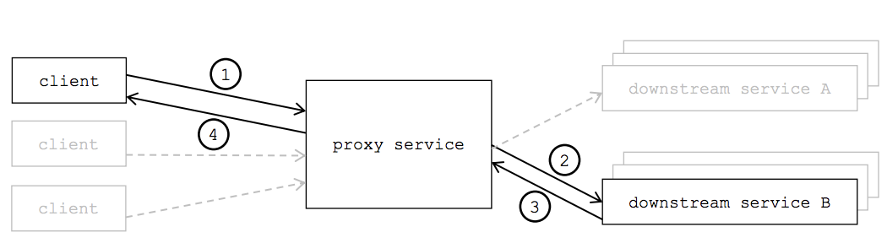

# Custom Nginx Docker Image <a name="custom_nginx"></a>

## Requirements <a name="requirements"></a>
For this demo, we are going to achieve the following requirements:


- Reverse Proxy/Load balancer 127.0.0.1:8080
- Downstream services at 10.0.0.[1-2]:9090 (which is out of scope)
- Monitoring at 127.0.0.1:8081

In short, the Nginx docker listens to port 8080 and 8081.
```
# 8080 for reverse proxy
my-service.my-company.com:8080 -> nginx -> 10.0.0.1:9090
                                        -> 10.0.0.2:9090

# 8081 for monitoring
127.0.0.1:8081 -> nginx -> 127.0.0.1:8081/nginx_status
```


Index
- [Nginx.conf](#nginx_conf)
  - [reverse proxy](#reverse_proxy)
  - [monitoring](#monitoring)
- [Dockerfile](#dockerfile)
- [Docker-compose](#nginx_docker_compose)
- [How to Test](#how_to_test)
  - [Manual Test](#manual_test)
  - [Dockerlized Automated Test: BDD Test using Python Behave](#bdd_test)


## Nginx.conf <a name="nginx_conf"></a>

[nginx.conf](nginx.conf) contains configurations for reverse proxy on port 8080 and monitoring on port 8081.

### Reverse Proxy <a name="reverse_proxy"></a>
```
http {
  # load balancing with round-robin as default algorithm (must be under http{} context)
  upstream downstream_services {
    # enable sticky session by creating hash table for IPs and proxy requests
    #ip_hash;

    # enable load balancing based on # of connections
    # least_conn;

    server 10.0.0.1:9090;
    server 10.0.0.2:9090;
  }

  server {
    # reverse proxy
    location / {
        # reverse proxy: should end with trailing /
        # specify upstream name to enable load balancing
        proxy_pass http://downstream_services/;

        # set header for proxy request because add_header won't propagate to proxy header
        proxy_set_header Host $host;
        proxy_set_header X-Forwarded-Proto $scheme;
        proxy_set_header X-Real-IP $remote_addr;
        proxy_set_header X-Forwarded-For $proxy_add_x_forwarded_for;
    }
  }
}
```

### Monitoring <a name="monitoring"></a>
First make sure the module is enabled
```
$ nginx -V 2>&1 | grep -o with-http_stub_status_module
with-http_stub_status_module
```
Then expose a new endpoint
```
http {
  server {
    listen 8081;

    # rewrite a request to / to /nginx_status
    rewrite ^/ /nginx_status;
    
    # stub status - this will be exposed so other monitoring solution like Prometheus can scrape data
    # for example, we could use NGINX Prometheus Exporter (https://github.com/nginxinc/nginx-prometheus-exporter)
    location /nginx_status {
        stub_status;
  }
}
```
Verify
```
$ curl http://localhost.com:8081/nginx_status 

Active connections: 1
server accepts handled requests
 18 18 15
Reading: 0 Writing: 1 Waiting: 0
```

### Optional Monitoring Integration
Now third party monitoring tools can utilize info available at `/nginx_status` endpoint.

One of them that we'll use to demonstrait is [amplify](https://www.tecmint.com/amplify-nginx-monitoring-tool/).

Configure log format:
```
http {
  # custom log format for third-party monitoring
  log_format main_ext '$remote_addr - $remote_user [$time_local] "$request" '
                      '$status $body_bytes_sent "$http_referer" '
                      '"$http_user_agent" "$http_x_forwarded_for" '
                      '"$host" sn="$server_name" ' 'rt=$request_time '
                      'ua="$upstream_addr" us="$upstream_status" '
                      'ut="$upstream_response_time" ul="$upstream_response_length" '
                      'cs=$upstream_cache_status' ;
                      'upstream_cache_status=$upstream_cache_status' ;
  access_log /var/log/nginx/access.log main_ext;
  error_log /var/log/nginx/error.log warn;
}
```
Sign up for a free account at `https://amplify.nginx.com`, then execute two commands
```
$ curl -L -O https://github.com/nginxinc/nginx-amplify-agent/raw/master/packages/install.sh

$ API_KEY='YOUR_API_KEY' sh ./install.sh
```


Refs
- [The Nginx doc](https://serverpilot.io/docs/how-to-enable-nginx-http-stub-status-module)
- [Total Nginx monitoring, with application performance and a bit more, using Telegraf/InfluxDB/Grafana](https://medium.com/faun/total-nginx-monitoring-with-application-performance-and-a-bit-more-using-8fc6d731051b)
- [MONITORING NGINX: THE ESSENTIAL GUIDE](https://www.scalyr.com/blog/how-to-monitor-nginx-the-essential-guide/)

## Dockerfile <a name="dockerfile"></a>
[Dockerfile](Dockerfile) does a few things: make new dirs, copy files from our local host to a new image, and then start a nginx service.
```
FROM nginx
CMD ["mkdir", "-p", "/var/www/my-company.com"]
CMD ["mkdir", "-p", "/etc/nginx/my-company.com"]

COPY nginx.conf /etc/nginx/nginx.conf
COPY index.html /var/www/my-company.com/index.html

CMD exec nginx -g 'daemon off;'
```

Let's build and run a new Nginx image:
```
# build a container image using Dockerfile in the current dir by passing "."
$ docker build -t hasakura12/nginx-reverse-proxy .

# let's map host port 8080 and 8081 to a container port 8080 and 8081, and run a container in background
$ docker run \
  --name nginx-reverse-proxy \
  --rm \
  -d \
  -p 8080:8080 \
  -p 8081:8081 \
  hasakura12/nginx-reverse-proxy

# hit the Nginx server through port 8081
$ curl localhost:8081
```
and you should get a response:
```
Active connections: 1
server accepts handled requests
 6 6 6
Reading: 0 Writing: 1 Waiting: 0
```

## Custom Nginx Docker Image using docker-compose <a name="nginx_docker_compose"></a>
### Prerequisite: docker-compose cli is installed

We could always run a docker container by the above
```
docker run \
  --name nginx-reverse-proxy \
  --rm \
  -d \
  -p 8080:8080 \
  -p 8081:8081 \
  hasakura12/nginx-reverse-proxy
```
But we could store these arguments in `docker-compose.yaml` file so we could maintain different configurations of different docker images.

[docker-compose.yaml](docker-compose.yaml) does that exactly: mapping host to container port, specifying docker image, etc.
```
version: '3'
services:
  nginx-reverse-proxy:
      image: hasakura12/nginx-reverse-proxy:1.00
      container_name: nginx-reverse-proxy
      ports:
          - 8080:8080
          - 8081:8081
      restart: always
```

All you need to do is simply run:
```
docker-compose up -d
```

If you want to stop the container, run:
```
docker-compose down
```

#### Extra: passing commands to docker run command
```
docker run \
  -d \
  --name nginx-reverse-proxy \
  nginx-reverse-proxy \
  /bin/bash \
  -c "echo hello; exec nginx -g 'daemon off;'"
```

### Push custom Nginx Docker image to your Dockerhub public repo
```
# tag existing image "hasakura12/nginx-reverse-proxy" as "hasakura12/nginx-reverse-proxy:1.00" (DOCKERHUB_USERNAME/REPO_NAME:TAG_VERSION)
$ docker tag hasakura12/nginx-reverse-proxy hasakura12/nginx-reverse-proxy:1.00

# login to dockerhub
$ docker login

$ docker push hasakura12/nginx-reverse-proxy:1.00
```
Docker image is available at `hasakura12/nginx-reverse-proxy:1.00`.

## How to Test <a name="how_to_test"></a>
### Manual Test <a name="manual_test"></a>
```
$ docker-compose up -d
Creating network "docker_default" with the default driver
Pulling nginx-reverse-proxy (hasakura12/nginx-reverse-proxy:latest)...
ERROR: manifest for hasakura12/nginx-reverse-proxy:latest not found
Hisashis-MacBook-Pro:docker hisashi.asakura$ docker-compose up -d
Pulling nginx-reverse-proxy (hasakura12/nginx-reverse-proxy:1.00)...
1.00: Pulling from hasakura12/nginx-reverse-proxy
f5d23c7fed46: Already exists
918b255d86e5: Already exists
8c0120a6f561: Already exists
89f8b52450df: Pull complete
8541e5ac2fee: Pull complete
Creating nginx-reverse-proxy ... done

$ docker ps
CONTAINER ID        IMAGE                                 COMMAND                  CREATED             STATUS              PORTS                                                  NAMES
4f94add853b1        hasakura12/nginx-reverse-proxy:1.00   "/bin/sh -c 'exec ng…"   12 seconds ago      Up 10 seconds       80/tcp, 0.0.0.0:8080-8081->8080-8081/tcp               nginx-reverse-proxy

$ curl localhost:8080/healthz
Hello from /healthz

$ curl localhost:8081/nginx_status
Active connections: 1 
server accepts handled requests
 5 5 5 
Reading: 0 Writing: 1 Waiting: 0 
```

### Dockerlized Automated Test: BDD Test using Python Behave <a name="bdd_test"></a>
We use Python BDD test framework `bahave` to test a Nginx image.

Simply execute the script:
```
$ ./automated_test.sh
```

For more details about implementations of dockerlized Python BDD tests, refere to [test/README.md](test/README.md).